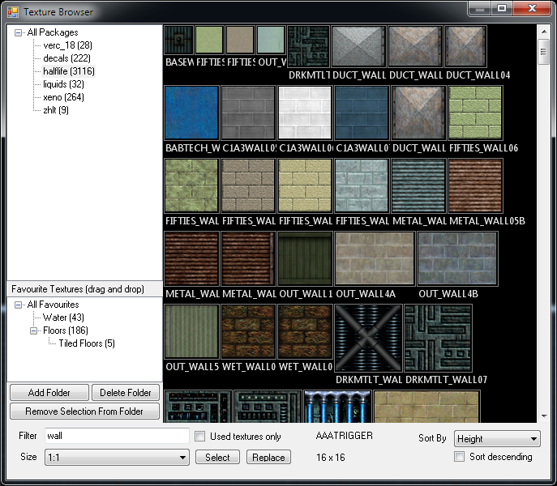

T3D
=======

Tiled 3d editor, t3d (pronounced ted), is a tile editor for a 3d world.

The plan is for the editor to work in three major phases:

The first part is the detailing out the level with minecraft/voxel like editing only placing cubes. The second part is replacing those voxels with polygon counterparts, created by an artist. This step should perhaps be more or less dynamic with logic based on [bitmasking](http://www.angryfishstudios.com/2011/04/adventures-in-bitmasking/). The third step is placing entities/detail objects and other data, perhaps adding some visual scripting language.

Or it will work like tiled placing tiles with a hammer like ui for browsing tiles and a sketchup like interface for creating new/custom tiles.

Link dump
==========

[Skate 3 - Create a park](https://www.youtube.com/watch?v=JMSXbOYxkhQ)
[Portal 2 - Map editor](https://www.youtube.com/watch?v=1-H4ev89nnU) [trailer](http://www.ign.com/videos/2012/04/30/portal-2-perpetual-testing-initiative)

2d:
http://opengameart.org/content/land-tileset
http://opengameart.org/content/land-tiles-v2

Isometric tiles:
http://opengameart.org/content/isometric-64x64-outside-tileset

3d:
http://opengameart.org/content/3d-rock-tileset
http://opengameart.org/content/cave-tileset
http://www.turbosquid.com/FullPreview/Index.cfm/ID/311543
http://dwarffortresswiki.org/index.php/User:Sphr/SketchUp

http://opengameart.org/content/free-3d-tileset-2
http://opengameart.org/content/free-3d-tileset-1

Real world tiles:
http://www.hirstarts.com/molds/moldssci.html

Creating a voxel engine:
https://sites.google.com/site/letsmakeavoxelengine/
http://www.flipcode.com/archives/Realtime_Voxel_Landscape_Engines-Part_1_Introduction.shtml
http://en.wikibooks.org/wiki/OpenGL_Programming/Glescraft_1